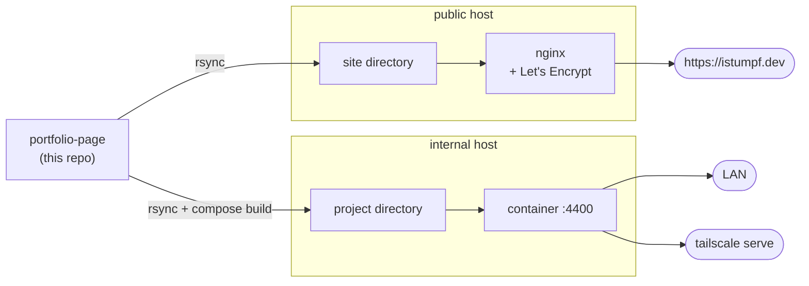

<div align="center">

# istumpf.dev

**Single-page portfolio for Imre Stumpf — DevOps Engineer.**

No build step. No framework. No external network requests.
Open `index.html` and it runs.

[**→ istumpf.dev**](https://istumpf.dev)


</div>

---

Hand-written HTML, CSS and vanilla JS. The icon set is inlined rather than
pulled from a CDN, so the page is complete offline and there is no third-party
request on load. Everything readable lives in one data file.

> **Badges are static on purpose.** This repository has no git remote, so
> dynamic badges (build status, last commit) would render as errors. Swap them
> for live ones if it ever gets pushed.

## Contents

- [Quick start](#quick-start) · [Layout](#layout) · [Editing content](#editing-content)
- [What's in it](#whats-in-it) · [Themes](#themes)
- [Deployment](#deployment) · [Operational notes](#operational-notes)
- [Still to wire up](#still-to-wire-up)

## Quick start

```sh
xdg-open index.html              # simplest: just open the file
python3 -m http.server 8000      # or serve it -> http://localhost:8000
```

## Layout

```
index.html                    the shell: sections and static copy
assets/css/style.css          all styling (tokens → primitives → sections → responsive)
assets/js/data.js         ←   EDIT THIS: projects, principles, skills, timeline, contact
assets/js/icons.js            local inline SVG icon set (27 icons, lucide-style)
assets/icons/                 favicon set built from the site's own brand mark
assets/js/main.js             rendering + interactions
construction/index.html       standalone bilingual holding page (HU / EN)
deploy/nginx/istumpf.dev.conf  the live public vhost, versioned
Dockerfile · docker-compose.yml  for the internal tailnet copy
```

## Editing content

Everything readable lives in **`assets/js/data.js`**. A new project is one more
object in the `projects` array.

> [!IMPORTANT]
> Any value in a project's `categories` must also appear in the `filters`
> array, or it will not be filterable.

The **"projects running live"** stat is *derived* from the project list
(`auto: "live"` counts entries with `status: "Live"`), so it cannot drift out of
sync with the cards or the hero terminal panel. It did drift twice when the
number was maintained by hand.

<details>
<summary><b>Which project entries are real, and which are placeholders</b></summary>

| Project | State |
|---|---|
| Ötösleszek AI | real — from the `otosleszek-full-stack` README |
| Hajnalhozó Shop | real — from the `hajnalhozo_shop` source and `.env.example` |
| Helén Panzió | real — from `helenpanzio_newage_marketing` |
| Homelab Platform | real — from `/var/homelab-automation` on the Proxmox host |
| Home & Site Automation | real — from the HA VM config and the host's Tailscale peers |
| This portfolio | real — this repository |
| Hajnalhozó App | **placeholder** — no repository found under `projects/` |

**A note on the homelab cards.** The Talos control-plane and worker VMs are
*not running continuously* — they are brought up when needed, and the control
plane was unreachable when this copy was written. The card is therefore worded
around what is actually true: the cluster is **declared** in Terraform and
rebuilt by a workflow, rather than claiming a cluster is serving traffic right
now. Keep that distinction if you edit it.

</details>

<details>
<summary><b>The favicon</b></summary>

`assets/icons/` reproduces the site's brand mark: rounded square, cyan → violet
at 135°, dark `IS` knocked out of it.

The letters are **vector paths, not `<text>`**. A favicon is rendered outside
the page, without its webfonts, so `font-family: "JetBrains Mono"` would
silently fall back to whatever monospace the platform happens to have — and the
mark would look different on every OS.

| File | Role |
|---|---|
| `icon.svg` | primary — scales to any size, what modern browsers use |
| `icon-32.png` | fallback, RGBA so the rounded corners stay transparent |
| `apple-touch-icon.png` | 180×180, **square and opaque** — iOS applies its own mask, so a pre-rounded icon would be rounded twice |

Two things worth keeping if you regenerate them:

- Glyphs are slightly larger and heavier than the on-screen mark (cap height
  10/32 vs ~9, stroke 2.6). A favicon needs a little more ink to survive 16px.
- There is deliberately **no 16px PNG**. The one generated here was mushier than
  the browser's own downscale of the SVG, so shipping it made things worse.

</details>

<details>
<summary><b>Adding a UI icon</b></summary>

Add the path to the `S` object in `assets/js/icons.js` (24×24 viewBox,
`stroke-width: 2`), then reference it by name from `data.js`. The set is local
because `github` and `linkedin` were dropped from lucide core and
`check-circle-2` was renamed — a CDN would have silently lost them.

</details>

## What's in it

| Section | What happens |
|---|---|
| **Hero** | Canvas particle constellation with depth; scrolling drives parallax and motion trails. Aurora blobs, glitch role line, and a `stack.json` panel generated from the real project stacks. |
| **About** | Three principle cards, then skill meters that fill on scroll. |
| **Work** | 3D tilt cards with a cursor-following spotlight, category filter. |
| **Path** | A timeline rail that fills as you scroll. |
| **Contact** | Glowing inputs with client-side validation. |

Plus cursor glow, a scroll-progress bar, sticky nav with an active-section
marker, smooth scroll, and a complete `prefers-reduced-motion` path.

<details>
<summary><b>Scroll-driven particles — how it's tuned</b></summary>

Every particle carries a depth `z` (0.35–1). Nearer ones are larger and
brighter, shift further on scroll, and stretch into a short trail when you move
fast.

Velocity is measured in **px per frame** — the delta accumulated since the last
frame is consumed each frame — *not* as an accumulating impulse. The first
version got this wrong, and the trail sat at maximum length even during slow
reading. Measured profile after the fix:

| Scrolling | Trail length |
|---|---|
| slow reading (18 px/frame) | ~2 px — barely visible |
| normal wheel (60 px/frame) | ~5–8 px |
| fast fling (160 px/frame) | 20 px (hard cap) |
| anchor jump | ~6 px, decays in ~400 ms |

Tuning constants sit together at the top of `initCanvas()` in `main.js`.

**Related bug worth knowing:** `#bg-canvas` is a replaced element, so with
`position: fixed; inset: 0` a `width: auto` does **not** stretch — it takes the
intrinsic 300×150 and every particle crowds into the top-left corner. It needs
an explicit `width/height: 100%`. This was broken from the first commit and only
became visible when the canvas was screenshotted in isolation at full opacity.

</details>

<details>
<summary><b>Project grid heights — why <code>align-items</code> is left alone</b></summary>

Card lengths are genuinely uneven (652–1173 px). `align-items: start` looks
like the fix for the dead space inside short cards, but it does not shrink the
grid row — it only stops cards filling it, so the gap moves *out* into a visible
hole between rows. The row height is set by its tallest member either way.

The actual levers are card ordering and content length. Projects are ordered so
similar heights share a row, and the short placeholder lands last:

```
985  985  985   ← products
1173 1173 1173  ← infrastructure + this site
652             ← WIP placeholder, alone
```

</details>

## Themes

| Branch | Theme |
|---|---|
| `main` | **colourful** — cyan / electric blue / violet accents *(active)* |
| `theme/matrix-green` | pastel matrix green, monochrome 6-step ramp |

```sh
git switch theme/matrix-green   # green theme
git switch main                 # back to colourful
```

> [!NOTE]
> `theme/matrix-green` is **frozen as a colour reference.** It still carries the
> older Hungarian copy and the previous identity — only the palette is worth
> taking from it, and it lives in the `:root` block of that branch's
> `style.css`.

A theme is entirely the `:root` block of `assets/css/style.css`, plus the canvas
colours in `main.js` and the card accents in `data.js`.

## Deployment

> [!NOTE]
> **The public host currently serves `construction/index.html`, not the site.**
> The content is being reworked, so the full page is deployed only to the
> internal copy. The public directory holds that single file and nothing else —
> the unfinished `assets/` were removed rather than left publicly fetchable.
>
> To put the site back:
> ```sh
> rsync -az --delete index.html assets <host>:/var/istumpf-dev/
> ```

Two targets, on purpose: a public one and an internal one.



| Target | Serving |
|---|---|
| **public host** | nginx straight from a directory — no container, no app process. Cert from Let's Encrypt, renewed by `certbot.timer`. |
| **internal host** | Docker container on port 4400, HTTPS terminated by `tailscale serve` in front. |

Publishing is an `rsync` of `index.html` and `assets/` to the public host, and
an `rsync` + `docker compose up -d --build` for the internal copy. The vhost
that serves the public copy is versioned here as
`deploy/nginx/istumpf.dev.conf`.

> [!NOTE]
> Concrete hostnames, addresses and DNS-provider specifics live in a local
> runbook that is **not** in this repository — this is a public repo. The
> procedures below are complete without them.

> [!WARNING]
> As deployed, the internal container binds `0.0.0.0:4400`, so **anyone on that
> LAN reaches it over plain HTTP**. Bind it to the host's tailnet address
> instead if that is not wanted — see the commented variant in
> `docker-compose.yml`.


### Continuous deploy

`.github/workflows/deploy.yml` runs on a **self-hosted runner on the host that
serves the site**, so a deploy is a local file copy — there is no SSH key stored
anywhere for it.

```
push to main ─► runner (on the web host) ─► rsync into the webroot ─► smoke tests
```

**What gets published is version-controlled.** `deploy/published` holds a single
word, `construction` or `site`, and the workflow reads it. Flipping what the
public sees is therefore a commit you can review, not a hidden setting. A manual
`workflow_dispatch` can override it for one run.

When it publishes the holding page it also **deletes** the site's `css/js` from
the webroot, and a later step asserts those paths return 404 — the unfinished
content should never be fetchable just because a deploy ran.

> [!WARNING]
> **Public repo + self-hosted runner.** The only triggers are `push` to `main`
> and manual dispatch. There is deliberately **no `pull_request` trigger** — that
> is what would let anyone open a PR from a fork and run their code on the
> runner. Do not add one. Also set *Settings → Actions → General → Fork pull
> request workflows from outside collaborators* to require approval.
>
> The runner runs as an unprivileged user whose primary group is `www-data`, so
> it can write the webroot with **no sudo at all**. Keep it that way.

Registering the runner needs a token from GitHub, so it is a one-time manual
step: `sudo deploy/setup-runner.sh <registration-token>` on the web host. The
script pins the runner version rather than tracking `latest`.

## Operational notes

Things that cost time to find out. Worth reading before editing the vhost or
touching DNS.

<details>
<summary><b>⚠ nginx does not merge <code>add_header</code> across levels</b></summary>

A `location` containing **any** `add_header` discards **every** `add_header`
inherited from the `server` block.

The first revision of this vhost set `Cache-Control` with `add_header` inside
`location = /index.html` and `location /assets/`. That silently stripped the CSP
and all other security headers from precisely the responses that need them. It
was caught by inspecting the live response, not by reading the config.

`Cache-Control` is now set with `expires`, a separate directive that does not
clobber the inherited set. Verify after any change:

```sh
curl -sI https://istumpf.dev/ | grep -i content-security-policy
curl -sI https://istumpf.dev/assets/css/style.css | grep -i content-security-policy
```

</details>

<details>
<summary><b>TLS — and why there are no expiry emails</b></summary>

`certbot --nginx -d istumpf.dev -d www.istumpf.dev --redirect` issued an ECDSA
certificate for both names and added the 443 listener **into the existing server
block**, so the security headers apply to HTTPS as well. Re-check that after any
certbot run that touches this file. Renewal is handled by the already-active
`certbot.timer`.

Certbot wrote both `listen 443 ssl` and `listen [::]:443 ssl`, and nginx binds
both — verified with `ss -ltn`. (An earlier note in this file claimed the IPv6
listener was missing; that was wrong, and only the IPv4 line had been read.)

**Let's Encrypt no longer stores an account contact address.** `certbot
update_account -m ...` prints success, but the account object the ACME server
returns contains no `contact` field at all — the POST to `/acme/acct/…` answers
`200` with the same 467-byte body as before, verified in the debug log. So there
are no expiry-warning emails to rely on. Renewal automation is the real safety
net; if you want a second one, monitor certificate age from the Prometheus stack
already running on that host rather than expecting mail.

</details>

<details>
<summary><b>Moving a domain that also carries mail</b></summary>

Only web traffic needs to move: repoint the apex **`A`** record and leave
everything mail-related alone — `MX`, the SPF `TXT`, `_dmarc`, and any
`autoconfig` / `autodiscover` records the mail provider set up. A `www` record
that is already a `CNAME` to the apex follows on its own, so usually exactly one
record changes.

> [!IMPORTANT]
> Check the SPF mechanism **before** repointing. If SPF uses `include:` (or an
> explicit `ip4:`), moving the `A` record is safe. If it uses the bare `a` or
> `mx` mechanism, the A record *is* what authorises senders — repointing it
> silently breaks outbound mail SPF.

Skip `AAAA` unless IPv6 is verified end to end: with an `AAAA` present, Let's
Encrypt attempts **IPv6 validation first** and the issuance fails if that path
is not actually routed.

</details>

<details>
<summary><b>Browser still showing the old page after a DNS change</b></summary>

Check the authoritative servers before touching anything else:

```sh
dig +norecurse @<authoritative-ns> istumpf.dev A +short   # authoritative
dig @1.1.1.1 istumpf.dev A +short                         # public resolver
dig istumpf.dev A +short                                  # what you see
resolvectl flush-caches                                   # local cache only
```

If the authoritative servers and the public resolvers already return the new
address but your machine does not, the record is fine — something between you
and them is caching it.

A stale answer that **survives `resolvectl flush-caches`** is cached *upstream*,
typically by the LAN router acting as DNS forwarder. Query it directly
(`dig @<router-ip> istumpf.dev A`) and watch the TTL count down; it expires on
its own, with nothing to fix.

</details>

<details>
<summary><b>The holding page</b></summary>

`construction/index.html` is deliberately **one self-contained file with no
JavaScript**. The served CSP is `script-src 'self'`, so an inline `<script>`
would be blocked — the HU/EN switch is therefore pure CSS: two visually hidden
radio inputs and `:checked ~` sibling selectors.

The radios use the sr-only *clip* pattern rather than `opacity: 0;
pointer-events: none`, so they stay focusable and the native radio group still
works from the keyboard (Tab in, arrow keys to switch). Styling the labels alone
would have made the switch mouse-only.

The active option is marked with the site's own brand gradient (cyan → violet)
and dark text, matching how the rest of the UI marks a selected item.

> National-colour fills were tried and reverted — see the git history if you are
> tempted. They work technically (the label sits at 9.7–20:1 once the gradient
> has blended toward its white middle) but they pull the eye away from
> everything else on a page whose whole palette is two neon accents.


It also carries `<meta name="robots" content="noindex, nofollow">`, so the real
site does not come back to a search index full of "under construction".

</details>

## Still to wire up

- [ ] The contact form **validates but does not send**. Replace the `setTimeout`
      in `wireForm()` (`assets/js/main.js`) with a `fetch` to your own endpoint,
      or point it at Formspree / Resend.
- [ ] The contact address is still `surmi64@gmail.com`. For
      `hello@istumpf.dev`, create the mailbox first, then change `person.email`
      and the matching `socials` entry in `data.js`.
- [ ] Replace the `Hajnalhozó App` placeholder, or drop it: at 6 cards the grid
      is a clean 3 + 3 with no orphan row.
- [x] Point `istumpf.dev` at the deployment and serve it over HTTPS.
